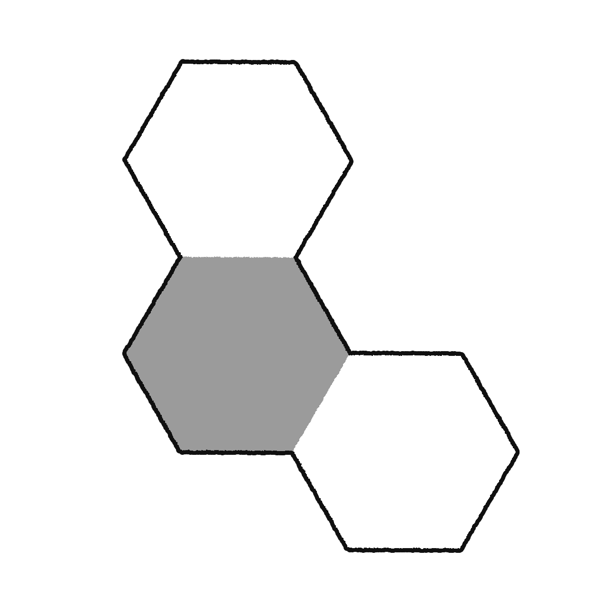

<div align=center></div>

<h1 align=center>H I R O - B O T</h1>

<p align=center>
<sub>
Hiro Bot is a WhatsApp automation framework built on Baileys and powered by Google Gemini AI. It brings together conversational AI and a comprehensive command set — downloading media from platforms like Instagram, TikTok, and YouTube, creating stickers, managing groups, and more — so users can interact naturally instead of memorizing syntax. Its self-healing architecture detects plugin errors, applies AI-assisted fixes automatically, and keeps the bot running with minimal downtime.
  </sub>
</p>

<div align=center width="100%">
  
  
  
  
  
  <a href="https://github.com/hiroosy/"></a>
</div>

---

<a href="#"></a>

<div align=right>
  <sub align=left>
<li>Multi Sessions.</li><br>
<li>Support AiRich and Buttons.</li><br>
<li>Very Light-built.</li><br>
<li>Auto-Heal Plugins.</li><br>
<li>Website Login.</li><br>
<li>Smart Ai Agent.</li><br>
<li>98% No Apikey.</li><br>
<li>Minimalist Design.</li><br>
<li>No Encrypted File.</li><br>
  </sub>
</div>

<br>

<details>
  <summary align=left><sub>AI INFO</sub></summary>
<sub>
  
  ```bash
'Model Used:'
Gemini 3.1 Lite-Flash > Daily conversation
Gemini 3.1 Lite       > Daily conversation but more complex
Gemma-4-31b-it        > For system Auto-repair / coding
Gemma-4-26b-a4b-it    > For system Auto-repair / coding
  ```

```python
✦ Total tools: 49
- Database     : read_database, write_database
- File Ops     : read_file, write_file, list_files, delete_file, move_file, search_files
- Messaging    : send_as_file, send_codeblock, get_group_info, send_message, list_owners, forward_media, reply_now, send_rich_reply
- Group Mgmt   : group_member_action, group_settings, group_link, group_leave, group_join_requests
- Media & AI   : download_media, generate_image, ai_edit_image, view_website, fetch_html_raw, view_link_post
- Memory       : remember, recall, list_learned, forget, pin_note, unpin_note, list_pinned_notes, log_failure
- Reminders    : create_reminder, list_reminders, cancel_reminder
- Plugins      : list_plugins, run_plugin, check_plugin_risk, read_plugin_guide
- System       : system_time, shell_exec, run_python, system_info, restart_bot, install_package, search_web
```

</sub>
</details>

<details>
  <summary align=center><sub>SENDMESSAGE</sub></summary>
<div align=left>
<sub>
  
```javascript
//---Basic---
conn.reply(m.chat, 'Hello world!', m)

conn.sendFile(m.chat, media, filename, caption, m)
// media > buffer / fs path
// voice note > { ptt: true }
// document > { document: true }

conn.sendContact(m.chat, [
  ['6281234567890', 'HirooSy'],
  ['6289876543210', 'Hiro']
], m)

conn.react(m.chat, '👍', m.key)
```

```javascript
//---location interactive ---
conn.sendLocUrl(m.chat, 'https://example.com/thumb.jpg',  'Title',                     'Address', 'Text', 'Footer', 'https://github.com/hiroosy', m)

//--- Url Preview ---
conn.sendUrlPreview(
  m.chat,
  'https://example.com/thumb.jpg',
  'https://example.com Hello World!',
  'Url Preview Title',
  'Url Description',
  'IMAGE',   // true for highQuality, or ['IMAGE', true]
  m
)

//--- Carousel ---
conn.sendButton(m.chat, {
    text: 'Interactive with Carousel!',
    footer: 'HirooSy',
    cards: [
        {
            image: { url: './path/to/image.jpg' },
            caption: 'Image 1',
            footer: 'Image 1',
            nativeFlow: [{ text: 'Source', url: 'https://example.com', useWebview: true }]
        },
        {
            image: { url: 'https://example.com/image.png' },
            caption: 'Image 2',
            footer: 'Image 2',
            ltoText: 'New Coupon!',
            ltoCode: 'HiroBot',
            ltoUrl: 'https://example.com',
            nativeFlow: [{ text: 'Source', url: 'https://example.com' }]
        }
    ]
}, m)

//--- Interactive buttons ---
conn.sendButton(m.chat, {
    image: { url: './path/to/image.jpg' },
    caption: 'Interactive!',
    footer: 'My Bot',
    optionText: 'Select Options',
    optionTitle: 'Select Options',
    ltoText: 'HirooSy',
    ltoCode: 'Hiro bot',
    ltoUrl: 'https://example.com',
    nativeFlow: [
        { text: '👋🏻 Greeting', id: '#Greeting' },
        { text: '📞 Call', call: '628123456789' },
        { text: '📋 Copy', copy: 'Hiro bot' }, 
        { text: '🌐 Source', url: 'https://example.com', useWebview: true },
        {
            text: '📋 Select',
            sections: [
                { title: '✨ Section 1', rows: [{ header: '', title: '🏷️ Coupon', description: '', id: '#CouponCode' }] },
                { title: '✨ Section 2', highlight_label: '🔥 Popular', rows: [{ header: '', title: '💭 Secret Ingredient', description: '', id: '#SecretIngredient' }] }
            ],
        }
    ]
}, m)

//--- Ai Rich ---
await conn.aiRich()
    .setTitle('Ai Rich Message') 
    .addText('[HyperLink](https://example.com)\nCitation [](https://example.com)'\n[x^2+y^2=r^2|100|100](https://example.com/latex.png))
    .addImage('https://example.com/image.png')
    .addCode('javascript', `console.log('Hello World')`)
    .addTable([
        ['Name', 'HirooSy'],
        ['Bio', 'Im developer'],
        ['Age', '67']
    ])
    .addSource([['https://example.com/favicon.ico', 'https://example.com', 'Source']])
    .addTip('Tip Text')
    .addSuggest(['Continue', 'Cancel'])
    .send(m.chat, { quoted: m })
```
</sub>
</div>
</details>

<details><summary align=right><sub>AUTO-HEAL</sub></summary>
    
<sub align=center>
  
```bash
Plugin Error
↓
Detect error line, Read stack trace
↓
Auto-Heal using AI Gemma 4
↓
Write file & Save
↓
Done
```
</sub>

</details>

  <br/>
  
---

  <div>
  <sub align=left>
    
```bash
$ git clone https://github.com/HirooSy/HIROBOT.git
$ npm install
$ cp .env.example .env
$ nano .env
$ npm start
```
</sub>
</div>

<div align=center>
  <a href="https://optiklink.com"></a>
    
  <a href="#"></a>

</div>